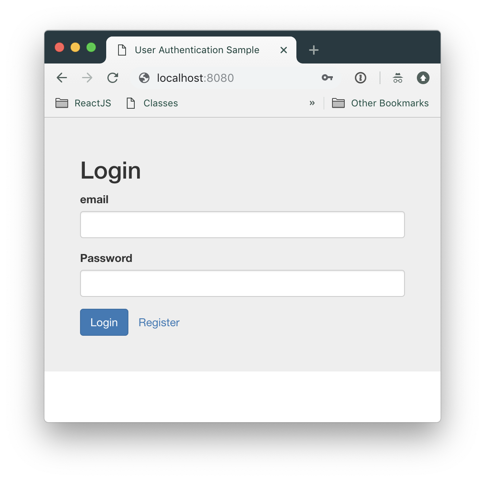

# Client UI for Authentication API Server boilerplate
A sample of client-side application using React/Redux that interacts with the [Authentication API Server](https://github.com/jaxyeh/node-rest-api), it has basic features such as User Registeration, Login, and Profile page.

<p align="center">
  
</p>

## Features
- [React](https://reactjs.org/) - A JavaScript library for building user interfaces
- [Redux](https://redux.js.org/) - A state container for JavaScript Apps
redux-thunk
- [Redux-Thunk](https://github.com/reduxjs/redux-thunk) - A thunk middleware for Redux
- [Webpack](https://webpack.js.org/) - A static module bundler for modern JavaScript applications
- [webpack-dev-server](https://github.com/webpack/webpack-dev-server) - Serves a webpack app
- [Docker](https://www.docker.com/) - This app supports bundling into Docker containerization

<p align="center">
  <sub>
    Coded with ❤️ by <a href="#authors">Jason Yeh</a>.
  </sub>
</p>

## Prerequiesis

* Node.JS


## Getting Started
Firstly, you need to install this package.
```bash
yarn
```
Run the Webpack Server
```bash
yarn start
```
The client application is available at [http://localhost:8080](http://localhost:8080).
